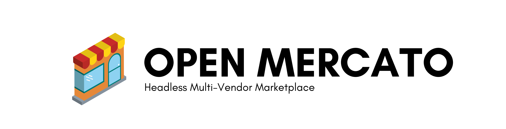

# Open Mercato Multi-Vendor Marketplace

Welcome to the **OpenMercato** project! We're playing here with an idea for Open Source Multi-Vendor marketplace product. 

The project is designed API First and headless. Based on NestJS, MongoDB, TypeScript and GraphQL.

We're starting easy, with kind of modular-monolith architecture approach including 3 base apps:

- **api** - which is the core API including authorization, listings, reviews.
- **admin** - which is React (and material-ui) based admin panel and merchant center for the vendors,
- **marketplace-starter** - also React based frontend app, a template for all soft of multi vendor marketplace apps.

## Keep fingers crossed and support us!

We're just doing very first steps and any support is much appreciated. You can send us some positive feedback over contributors@catchthetornado.com, post some <a href="https://github.com/CatchTheTornado/OpenMercato/issues">issues</a> or <a href="https://github.com/CatchTheTornado/OpenMercato/pulls">contribute your own code with the pull requests</a>. Thank you!

<a href="https://gitpod#https://github.com/CatchTheTornado/OpenMercato">Play with the code on Gitpod</a>

## License

It's MIT license. Open Source.  

## Partners

The project is in the incubation phase, backed by <a href="catchthetornado.com">Catch The Tornado</a>.

